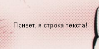
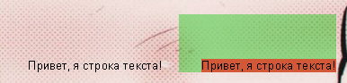

Meters
====

Meter - обьект, отвечающий за визуальную составляющую `скина <../skins/index.html>`_, стоит на ряду вместе с `measures <../measures/index.html>`_.

.. toctree::
	:maxdepth:2
	:name:toc-meters

	-
	-
	-
	-
	meter_image
	-
	-
	-
	-
	meter_string

Использование
++++

Meter не имеет "`значения <https://ссылка>`_", как их имеют measures. Некоторые meters могут отображать и отвечать на информационные значения двумя способами:

* Meter может быть связан с measure. Таким образом meter будет отображать значения measure, в зависимости от своего типа. Например, `meter string <meter_string.html>`_ будет отображать строковое значение measure в текстовом блоке, а `meter bar <meter_bar.html>`_ - отображать значение того же measure в `процентах <ссылка>`_ от максимального значения. Для некоторых типов meter необходима привязка к measure (для остальных это не обязательно)
* Meter может использовать все варианты переменных. Сюда входит `раздел с переменными <ссылка>`_, который даёт альтернативный способ использования значений measure.

Не все meters используются для отображения информации. Некоторые используются для создания статичных елементов, таких как фоновое изображения, рамки и меток (англ. *labels*, метки или ярлыки, короткая фраза или слово, например "Настройки:"). Конкретные параметры и требования к каждому типу meter детально описан в отдельных статьях.

Формат
++++

Meter записывается как `раздел в скине <ссылка>`_. Все meters имеют параметр ``Meter``, который нужет для определения всего раздела как тип meter. Большинство параметров meter зависят от его типа, но есть некоторые `общие параметры <ссылка>`_, которые действительны для некоторыз или всех meters.

Ниже приведён пример полностью рабочего раздела meter:

.. code-block:: Ini
	:linenos:

	[MeterSectionName]
	Meter=String
	Text=Привет, я строка текста!

Позиционирование
++++

Meter имеет определённые  **положение**, которое задаётся `параметрами X и Y <ссылка>`_, и **размеры**, которые задаються `параметрами W и H <ссылка>`_. Это значит, что meter ограничен прямоугольным блоком пикселей, даже если он имеет `прозрачный фон <ссылка>`_ и кажется "свободно-плавающим".

Meters расположены в пределах `окна скина <ссылка>`_. Это значит, что при перемещении скина meters перемещаются вмечте с ним. А так же, позиции meters задаються относительно левого верхнего угла скина, а не рабочего стола. Например, meter с параметром ``X=15`` начинается с 15 пикселей вправо от левого края скина.

Размер **окна скина**  зависит от положения и размеров всех meters при загрузке скина. Если в скине включен параметр `DynamicWindowSize <ссылка>`_, то окно будет "выдвинуто" наружу при перемещени meters вправо или вниз или масштабироварии по высоте или ширине. Однако, если meters будут влево за ``X=0`` или вверх за ``Y=0``, то они будут обрезаны или вовсе не видны. Технически никаких ограничений в размере окон скинов нет, но, практически, скин должен быть сделан так, что бы соответствовать размерам `области рабочего стола <ссылка>`_. 

	
	*Слева: скин с одним meter, который кажется "свободно-плавающим". Справа: тот же скин, но с добавлением цветного фона. Здесь видно, что meter (оранжевый).

Порядок
++++

Порядок meters в коде скина важен и определяется двумя путями:

* **Позиция "Z".**. Meters рисуються по порядку.Те, которые написаны ниже, появляются поверх тех, которые выше. Например, фоновое `изображение <meter_image.html>`_, которое находится под всеми meters, должно быть написано самым первым в коде скина.
* **Относительное положение.** Положение meter по X или Y можно установить "`относительно <ссылка>`_ положения предыдущего meter. Это полезно для групп meters, которые следуют за одним шаблоном, например списки, вкладки или пункты меню.

MeterStyles
++++

Meters могут использлвать параметры ищ других meters. Используя параметр `MeterStyle <ссылка>`_, один meter может **наследовать** все параметры одного или нескольких "родительских" разделов.

Больше на странице `MeterStyle <ссылка>`_.